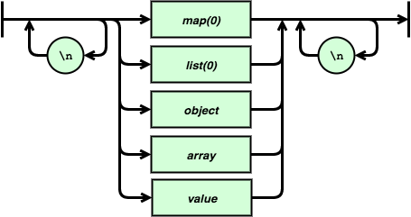
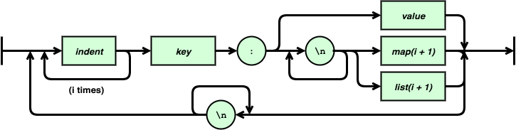
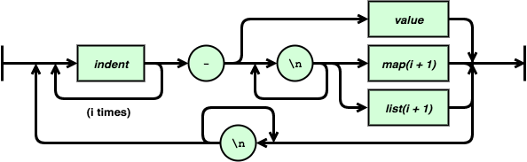
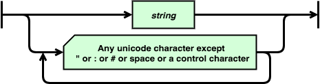
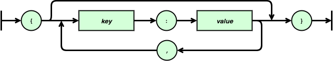
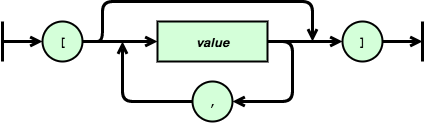
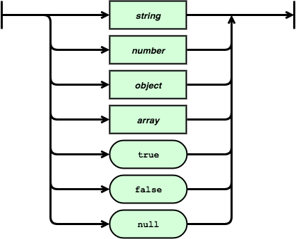
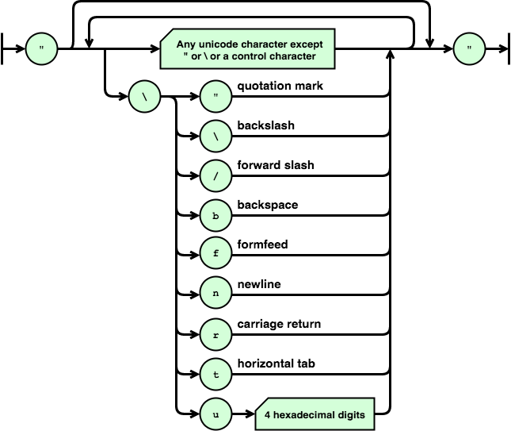
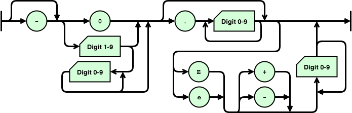
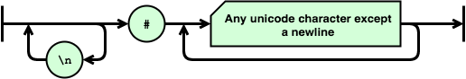

# YASON

YASON is a lightweight data-interchange format. It is designed to be easy for humans and machines to write and understand.

YASON is inspired by YAML and JSON. It aims to keep the transparency and simplicity of JSON with the readability of YAML.

JSON is a great format, it is simple enough that anyone can learn it in a few minutes, and you could write a parser for it in any language in a few hours. YAML is very readable format, but it has a huge spec, which means parsers are complex, prone to bugs and rarely implement the entire spec.

YASON is strictly a superset of JSON (unlike YAML which has whitespace restrictions), YASON implements the minimum complexity needed to produce readable documents.

## Blocks

The YASON spec is described in a similar way to the [JSON spec](http://json.org/). YASON's structure is defined in blocks, listed below. Each block is described with a flowchart. Rectangular boxes are used to denote nested blocks. Rounded boxes are used to denote literal characters. Boxes with a diagonal corner denote a description of one or more characters.

### document
A document describes the structure of a parsable document (JSON does not explictly define this, but implicitly allows an array or object).

### map(i)
A map is a whitespace sensitive version of an object. `i` is number of levels of indentation items within it.

### list(i)
A list is a whitespace sensitive version of an array. `i` is number of levels of indentation items within it.

### key
A key is a quoted or unquoted string, used in the key of a map or object.

### indent
An indent-unit represents a single level of indentation, e.g. 2 spaces. This must be identical for every instance in a document.

### object
This is an unordered list of key value pairs, identical to JSON except that keys can be unquoted.

### array
This is list of values, identical to JSON.

### value
A value, identical to JSON.

### string
A string, identical to JSON.

### number
A number, identical to JSON.

### comment
A comment at the end of a line or on its own line. Allowed before any valid newline (see whitespace section).

## Whitespace
In some blocks, additional whitespace is allowed between tokens.

- Whitespace is allowed between any tokens in an object or array (as in JSON).
- Spaces and tabs are allowed at the start and end of a document; and between any tokens in a document, list or map.
- However, spaces and tabs are not allowed before or after an indent, list or map block.
- Whitespace is not allowed between tokens in any other blocks.
