# Yason [![build status][circle-badge]][circle-url] [![coverage status][coverage-badge]][coverage-url]

Yason is a lightweight data-interchange format. It is designed to be easy for humans and machines to write and understand.

Yason was inspired by YAML and JSON. It aims to combine the transparency and simplicity of JSON with the readability of YAML.

Yason is also a superset of JSON, which means any valid JSON document can be used as Yason.

## Example

```yason
# Simple values
bar: "zig"
zim: 23.2
gir: null # Inline comment
dib: true
dab: false

# Objects
zig:
  foo: "bar"
  zim: "gir"

# Arrays
zip:
  - "zim"
  - "gir"

# Nested structures
zoo:
  -
    foo: 1
    bar: 2
fig:
  goo:
    - 3
    - 4

# JSON structures
tau: {
  foo-bar: 1
  "zig zag": 2
  "dib:": 3
  "dab#": 4
}
tow: [1, 2, 3]
```

Yason primitive values are identical to YAML (which means strings must be double quoted). Keys in Yason can be unquoted as long as they don't include a double quote, colon or whitespace. Comments can be added to the end of any line.

Yason supports any kind of indentation, as long as it is consistent within a document.

## Structure

The Yason spec is described in a similar way to the [JSON spec](http://json.org/). Yason's structure is defined in blocks, listed below. Each block is described with a flowchart.

- Rectangular boxes are used to denote nested blocks.
- Rounded boxes are used to denote literal characters.
- Boxes with a diagonal corner denote a description of one or more characters.

Boxes coloured in blue (`padding`, `spacing`, `whitespace` and `comment`) are optional, stylistic and do not affect the parsed data structure.

### document

A document describes the structure of a parsable document (JSON does not explictly define this, but implicitly allows an array or object).

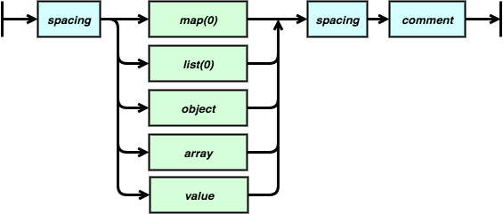

### map(i)

A map is a whitespace sensitive version of an object. `i` is number of levels of indentation items within it.

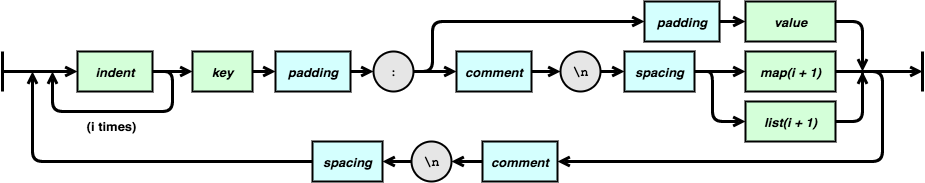

### list(i)

A list is a whitespace sensitive version of an array. `i` is number of levels of indentation items within it.

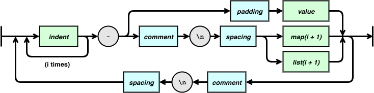

### key

A key is a quoted or unquoted string, used in the key of a map or object.

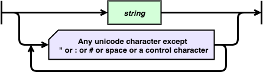

### indent

An indent-unit represents a single level of indentation, e.g. 2 spaces. This must be identical for every instance in a document.

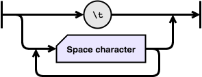

### object

This is an unordered list of key value pairs, identical to JSON except that keys can be unquoted, and comments are allowed.

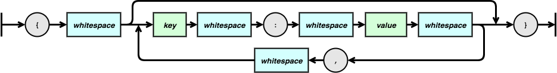

### array

This is list of values, identical to JSON except comments are allowed.

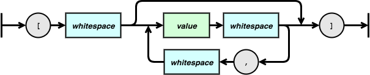

### value

A value, identical to JSON except comments are allowed.

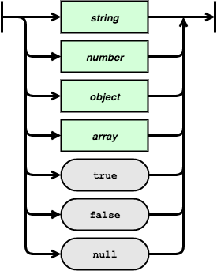

### string

A string, identical to JSON except comments are allowed.

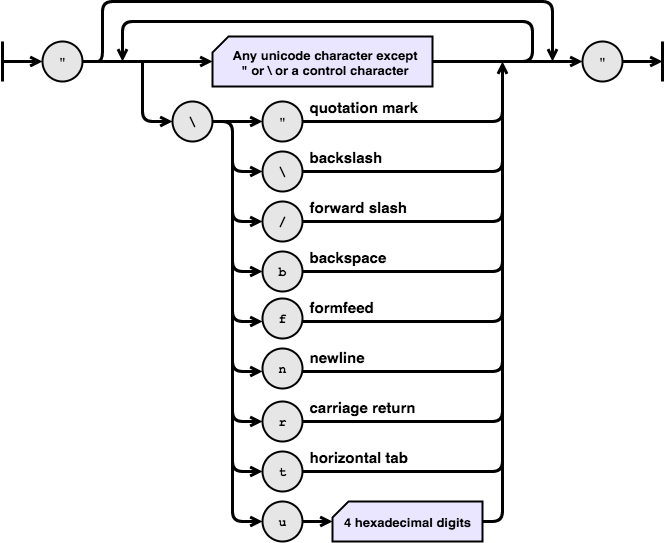

### number

A number, identical to JSON except comments are allowed.

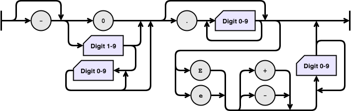

### padding

Optional padding between two tokens.


### comment

An optional comment at the end of a line or on its own line.


### spacing

Optional blank lines between two tokens, each line can contain a comment.


### whitespace

Optional padding or spacing between two tokens.

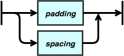

## TODO

- Add helpful parse error messages:
  - Negative numbers with spaces
  - Whitespace in quotes
  - Value token after value token - bad
  - Symbol not followed by colon
  - Invalid style of comment "//"
  - Single quotes
  - Missing padding after list index
- JSON support
- Create encoder, test against parser
- Look for ways to simplify parser given more flexible consume
- Only include whitespace for relevant fields
- Test mixed indentation and indentation failures

[circle-badge]: https://circleci.com/gh/peterjwest/yason.svg?style=shield
[circle-url]: https://circleci.com/gh/peterjwest/yason

[coverage-badge]: https://coveralls.io/repos/peterjwest/yason/badge.svg?branch=main&service=github
[coverage-url]: https://coveralls.io/github/peterjwest/yason?branch=main
